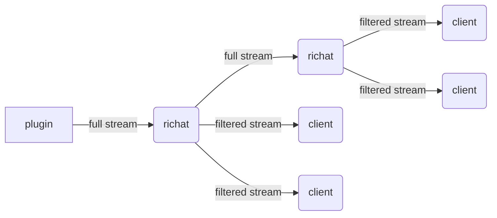
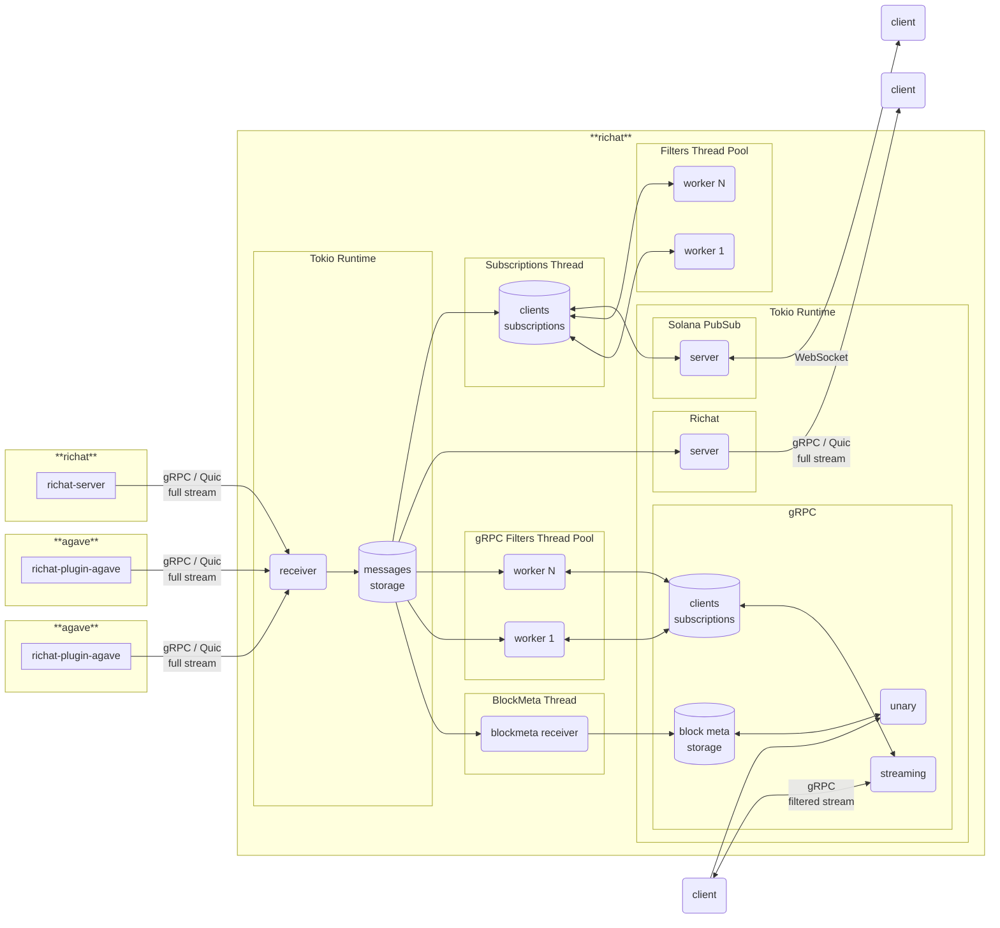

# This is a public fork maintained by [Solana tracker](https://www.solanatracker.io) 

# Richat

Richat is a streaming system designed to provide low latency and reliable streams of Solana blockchain data.

Richat offers a set of functionality to consume, filter and distribute streams of transactions, accounts and slots:

- Multiplexing, listening to multiple sources and providing a single stream output
- High performance filtering and de-duplication
- QUIC based streaming for higher throughput and lower latency
- gRPC support compatible with [Dragon's Mouth](https://github.com/rpcpool/yellowstone-grpc) clients
- Websockets interface compatible with the Websockets API provided by Agave

Richat can connect to a variety of sources even combining multiple different sources:

- Any [Yellowstone Dragon's Mouth / Geyser gRPC](https://github.com/rpcpool/yellowstone-grpc) compatible streaming endpoint
- Solana nodes running the included [richat-plugin-agave plugin](./plugin-agave)
- Solana nodes running the [Yellowstone Dragon's Mouth Geyser gRPC plugin](https://github.com/rpcpool/yellowstone-grpc)
- Other instances of Richat to create hierarchical streaming topologies with filtering at each level (see below)

Use Richat to build your own streaming infrastructure, whether you require websockets for browser clients or gRPC/QUIC for high performance backends. Richat is compatbile with the gRPC endpoints provided by most commerical Solana RPC providers and allows you to leverage a small number of incoming streams to serve a large number of clients.

Please use issues only for reporting bugs or discussing feature-related topics. If you're having trouble loading a plugin or need guidance on how to use crates, please post your question in the Telegram group: [https://t.me/lamportsdev](https://t.me/lamportsdev)

## Building and running

Build Richat by running

```bash
cargo build --release
```

Then create a config with your details following the example [config.yml](./richat/config.yml) and run Richat with:

```bash
./target/release/richat --config path/to/your/config.yml
```

## Sponsored by

## Blueprint





## Components

- `cli` — CLI client for full stream, gRPC stream with filters, simple Solana PubSub
- `client` — library for building consumers
- `filter` — library for filtering geyser messages
- `plugin-agave` — Agave validator geyser plugin https://docs.anza.xyz/validator/geyser
- `proto` — library with proto files, re-imports structs from crate `yellowstone-grpc-proto`
- `richat` — app with full stream consumer and producers: gRPC (`Dragon's Mouth`), Solana PubSub
- `shared` — shared code between components (except `client`)

## Releases

#### Branches

- `master` — development branch
- `agave-v2.0` — development branch for agave v2.0
- `agave-v2.1` — development branch for agave v2.1
- `agave-v2.2` — development branch for agave v2.2

#### Tags

- `cli-v0.0.0`
- `client-v0.0.0`
- `filter-v0.0.0`
- `plugin-agave-v0.0.0`
- `plugin-agave-v0.0.0+solana.2.1.5`
- `proto-v0.0.0`
- `richat-v0.0.0`
- `shared-v0.0.0`

At one moment of time we can support more than one agave version (like v2.0 and v2.1), as result we can have two different major supported versions of every component, for example: `cli-v1.y.z` for `agave-v2.0` and `cli-v2.y.z` for `agave-v2.1`. In addition to standard version, `plugin-agave` can have one or more tags with pinned solana version.


## gRPC replay (`from_slot`)

Richat serves downstream gRPC subscriptions locally. It consumes an upstream
processed stream and builds its confirmed and finalized streams from slot status
notifications. A downstream `from_slot` request is **not forwarded to Yellowstone**.
Upstream `from_slot` is used separately for Richat's own recovery/reconnection.

Without `channel.config.storage`, `from_slot` works at processed, confirmed, and
finalized commitments while the requested history is still complete in that
commitment's memory buffer. Older requests fail; there is no automatic upstream
historical fallback. The memory window depends on `max_messages` and `max_bytes`.

Disk replay is opt-in. Existing defaults remain **1,024 slots** and **processed
only**. To retain a 3,000-slot replay window for all commitments, add this under
`channel.config` in the Richat configuration:

```yaml
storage:
  path: ./db
  max_slots: 3000
  commitments: [processed, confirmed, finalized]
  chunk_compression: zstd-3
```

`commitments` selects which streams are available from disk; omitting it means
`[processed]`. It does not restrict live subscriptions or memory replay. The
processed journal is always retained internally for upstream recovery, including
when only confirmed or finalized disk replay is selected. Each enabled higher
commitment adds compact publication references to the journal. Payloads shared
between commitments are serialized and stored once during capture. Replay checks
commitment and slot headers before decoding protobuf messages, and uses a bounded
chunk cache to resolve references. Backpressured clients are deferred individually;
other ready replays continue on the same worker. Account deduplication, slot filters, entries, transactions,
block metadata, and complete blocks use the same filtering as the live stream.

Replay starts inclusively at `from_slot`, excludes updates for earlier slots,
and transitions to the matching live commitment stream without restarting at the
live tip. Skipped slots can start at the next retained slot; a future slot waits
on the live stream. Supplying `from_slot` again on an existing subscription starts
a new replay, even when its commitment is unchanged.

`max_slots` is a window in slot numbers, including skipped slots. Disk history
expires outside that window; disk files are reclaimed by whole segments and may
therefore occupy more space than the exact window. Replay reads and outbound
queues are bounded; a subscriber that falls behind disk retention receives an
explicit error. Pending chunks flush at publication boundaries, including an
idle flush after 100 ms, and payloads are synced before their metadata is committed.

The official Yellowstone protobuf client is exercised over HTTP/2 in regression
tests, including block-only `from_slot`, account data slices and lamport filters,
transaction filters, all commitments, and repeated replay requests. The old
blanket rejection `blocks are not possible to replay` is removed.

Existing processed-only disk files remain readable for processed replay. They do
not contain higher-commitment streams or complete block messages: requests for
those missing histories fail explicitly. Enabling a commitment after a restart
makes it available for newly captured slots, not for earlier history. The new
journal format is not readable by older Richat binaries; keep the previous data
directory separate if a downgrade is required.
